<!-- MADIHA M. SHAHID · GitHub Profile · Neon Purple -->

# Madiha M. Shahid

 

---

## About Me

I am an AI / ML engineer in training at **KIET University, Karachi** (CGPA **3.6**, expected **2027**). I build end-to-end machine learning systems in **Python** — from data cleaning and EDA to model evaluation — and I ship applied AI with **Google Vertex AI**, REST APIs, and production-minded tooling.

**Focus:** Machine Learning · Generative AI · LLMs · RAG · Computer Vision · Backend APIs

---

## Current Focus

| | Building & learning now |
|:---:|:---|
| 🤖 | **Large Language Models (LLMs)** · prompt design, evaluation, and applied GenAI |
| 📚 | **Retrieval-Augmented Generation (RAG)** · grounded answers over private data |
| ✍️ | **Prompt Engineering** · reliable outputs, structured generation, eval loops |
| 🧩 | **LangChain & AI Agents** · tool-calling, function calling, multi-step workflows |
| 👁️ | **Computer Vision** · YOLO, OpenCV, detection pipelines |

 

---

## Tech Stack

**Languages**

**ML / AI & Deep Learning**

**Web & APIs**

**Tools**

---

## GitHub Stats

  

 

---

## Featured Projects

<b>🧠 Jarvis — AI Virtual Assistant</b> · Python · SpeechRecognition · NLP · REST APIs

 

Voice-driven desktop assistant that listens, understands intent, and executes tasks through speech recognition and NLP. Integrates REST APIs for live information and system actions — a practical loop from audio in to action out.

<b>📊 Loan Approval Prediction System</b> · scikit-learn · pandas · Random Forest

 

End-to-end classical ML pipeline: data cleaning, EDA, feature engineering, then classification with Random Forest (plus model comparison). Evaluated with confusion matrices, cross-validation, and feature importance so the decision is explainable, not just accurate.

<b>📸 Face Recognition Attendance System</b> · Android · ML Kit · FaceNet

 

Mobile attendance flow that detects and recognizes faces on-device. Combines Android, ML Kit, and FaceNet-style embeddings for identification — built for real classrooms, not a notebook demo.

<b>🚧 In Progress — LLM Agents & RAG</b> · LangChain · Tool calling · Generative AI

 

Building tool-calling agents, RAG pipelines, and Generative AI demos — retrieval, evaluation, and agent loops that can use tools instead of hallucinating an answer.

---

## Connect

| | |
|:---|:---|
| GitHub | [github.com/Madiha-Shahid0212](https://github.com/Madiha-Shahid0212) |
| LinkedIn | [linkedin.com/in/madiha-shahid02](https://linkedin.com/in/madiha-shahid02) |
| Email | [madihashahid212@gmail.com](mailto:madihashahid212@gmail.com) |

 

 

*Train hard. Evaluate honestly. Deploy with intent.*

