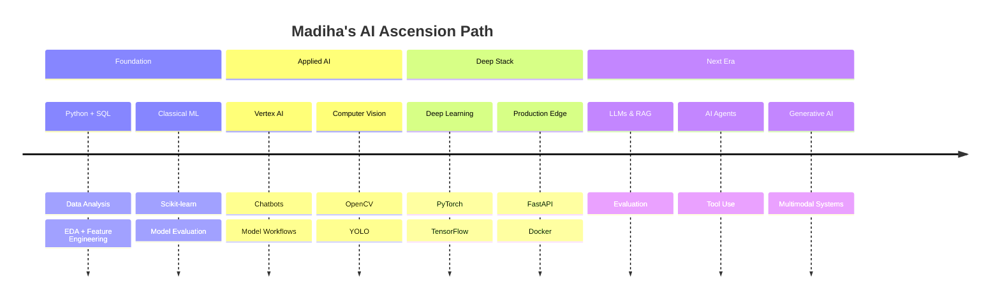

<!--
═══════════════════════════════════════════════════════════════
  MADIHA SHAHID — AI / MACHINE LEARNING ENGINEER
  GitHub Profile README · Cyberpunk Neon Edition
  Compatible with GitHub Markdown · Purple Neon Theme
═══════════════════════════════════════════════════════════════
-->

<div align="center">

<!-- ═══════════════════════ ANIMATED WAVE HEADER ═══════════════════════ -->


<!-- ═══════════════════════ CUSTOM BANNER PLACEHOLDER ═══════════════════════ -->


<br/>


<br/>

<!-- Profile identity badges -->

<a href="https://github.com/Madiha-Shahid0212">
  
</a>
<a href="https://github.com/Madiha-Shahid0212">
  
</a>
<a href="https://github.com/Madiha-Shahid0212">
  
</a>
<a href="https://github.com/Madiha-Shahid0212">
  
</a>

<br/><br/>

<!-- Social / contact row -->

<a href="https://linkedin.com/in/madiha-shahid02">
  
</a>
<a href="mailto:madihashahid212@gmail.com">
  
</a>
<a href="https://github.com/Madiha-Shahid0212">
  
</a>
<a href="https://github.com/Madiha-Shahid0212?tab=repositories">
  
</a>

<br/><br/>

<!-- Visitor Counter -->


<br/><br/>


</div>

<br/>

---

<div align="center">

## 🧬 SYSTEM BOOT · IDENTITY MATRIX


</div>

<br/>

<div align="center">

### 👋 Introduction

**AI / Machine Learning Engineer** · Final-year **BS Computer Science** @ **KIET University** (Expected **2027**) · Based in **Pakistan** 🇵🇰

I design, train, and evaluate machine learning systems — from classical models to computer vision pipelines and AI applications on **Google Vertex AI**.

My north star is becoming a **Production AI Engineer** working on:

`Computer Vision` · `LLMs` · `AI Agents` · `Deep Learning` · `Generative AI`

</div>

<br/>

---

<div align="center">

## 🔮 ABOUT ME


</div>

<br/>

```text
╔══════════════════════════════════════════════════════════════════╗
║  NAME        ::  Madiha Shahid                                   ║
║  ROLE        ::  AI / Machine Learning Engineer                  ║
║  LOCATION    ::  Pakistan                                        ║
║  EDUCATION   ::  BS Computer Science · KIET University · 2027    ║
║  FOCUS       ::  CV · LLMs · Agents · Deep Learning · GenAI      ║
║  STATUS      ::  Building · Learning · Shipping                  ║
║  VIBE        ::  Cyberpunk Lab Energy ⚡ Purple Neon Mode ON     ║
╚══════════════════════════════════════════════════════════════════╝
```

<br/>

<details open>
<summary><b>🧠 Expand Neural Profile</b></summary>
<br/>

| Attribute | Details |
|:---|:---|
| 🎯 **Mission** | Build production-grade AI that solves real problems |
| 🧪 **Strengths** | Machine Learning · Data Analysis · Computer Vision · Feature Engineering · EDA |
| 🛰️ **Cloud AI** | Hands-on with **Google Vertex AI** (chatbots, model workflows) |
| 📊 **Data Stack** | Python · Pandas · NumPy · Scikit-learn · SQL · MySQL |
| 👁️ **Vision Stack** | OpenCV · YOLO · annotation & dataset preparation |
| 🧩 **Full-Stack Edge** | React · Node.js · FastAPI · Firebase |
| 🚀 **Aspiration** | Production AI Engineer at a top AI lab / product company |

<br/>

- 🔭 Currently exploring **LLMs**, **AI Agents**, and **Generative AI** systems
- 🌱 Deepening **Deep Learning**, **PyTorch**, and **Computer Vision** pipelines
- 💬 Ask me about **ML model evaluation**, **EDA**, and **Vertex AI** workflows
- ⚡ Fun fact: I treat every dataset like a boss fight — clean it, engineer it, then ship the model

</details>

<br/>

---

<div align="center">

## 🎯 CURRENT FOCUS


</div>

<br/>

<div align="center">

| 🔥 Priority | Domain | Objective |
|:---:|:---|:---|
| 1️⃣ | **Computer Vision** | Detection · Recognition · Production CV pipelines |
| 2️⃣ | **Large Language Models** | Fine-tuning · RAG · Prompt systems · Evaluation |
| 3️⃣ | **AI Agents** | Tool-use · Multi-step reasoning · Autonomous workflows |
| 4️⃣ | **Deep Learning** | Neural nets · Training loops · Optimization |
| 5️⃣ | **Generative AI** | Multimodal systems · Creative + applied GenAI |

</div>

<br/>

<div align="center">

```diff
+ [ACTIVE]   Machine Learning & Predictive Modeling
+ [ACTIVE]   Data Analysis · EDA · Feature Engineering
+ [ACTIVE]   Google Vertex AI Applications
+ [TRAINING] Deep Learning with PyTorch / TensorFlow
+ [TRAINING] Computer Vision · OpenCV · YOLO
+ [NEXT]     LLM Applications & AI Agents
+ [NEXT]     Production MLOps & Dockerized Deployments
```

</div>

<br/>

---

<div align="center">

## ⚔️ TECH ARSENAL


</div>

<br/>

<div align="center">

### 💻 Programming Languages

| | | |
|:---:|:---:|:---:|
| <br/>**Python** | <br/>**JavaScript** | <br/>**SQL** |

<br/>

`Python` is my primary weapon for ML, data, and AI systems.

</div>

<br/>

<details open>
<summary><b>📦 Frameworks & Libraries</b></summary>
<br/>

<div align="center">

| Category | Stack |
|:---|:---|
| **Data Analysis** | `Pandas` · `NumPy` · `EDA` · `Feature Engineering` |
| **Machine Learning** | `Scikit-learn` · Classification · Regression · Clustering |
| **Deep Learning** | `PyTorch` · `TensorFlow` |
| **Computer Vision** | `OpenCV` · `YOLO` |
| **Backend / API** | `FastAPI` · `Node.js` |
| **Frontend** | `React` |
| **Cloud / Backend Services** | `Firebase` · `Google Vertex AI` |

<br/>


</div>

</details>

<br/>

<details>
<summary><b>🤖 Machine Learning</b></summary>
<br/>

<div align="center">

```text
┌─────────────────────────────────────────────────────────┐
│  SUPERVISED LEARNING                                    │
│  • Classification  • Regression  • Model Evaluation     │
│                                                         │
│  UNSUPERVISED LEARNING                                  │
│  • Clustering  • Customer Segmentation                  │
│                                                         │
│  PIPELINE SKILLS                                        │
│  • Data Cleaning  • Data Wrangling  • EDA               │
│  • Feature Engineering  • Predictive Modeling           │
└─────────────────────────────────────────────────────────┘
```

| Skill | Level |
|:---|:---|
| Scikit-learn | ████████░░ Advanced |
| Data Cleaning & EDA | ████████░░ Advanced |
| Feature Engineering | ███████░░░ Proficient |
| Model Evaluation | ███████░░░ Proficient |
| Predictive Modeling | ███████░░░ Proficient |

</div>

</details>

<br/>

<details>
<summary><b>🧠 Deep Learning</b></summary>
<br/>

<div align="center">

| Framework | Focus |
|:---|:---|
| **PyTorch** | Neural networks · Training workflows · Experimentation |
| **TensorFlow** | Model building · Applied deep learning practice |
| **Goal** | Production deep learning for vision & generative systems |

<br/>


</div>

</details>

<br/>

<details>
<summary><b>👁️ Computer Vision</b></summary>
<br/>

<div align="center">

| Tool / Topic | Application |
|:---|:---|
| **OpenCV** | Image processing · Vision pipelines |
| **YOLO** | Object detection experiments |
| **Annotation** | Bounding boxes · Dataset quality for training |
| **Vertex AI Vision workflows** | Applied AI / CV support in real projects |

<br/>


</div>

</details>

<br/>

<details>
<summary><b>✨ Generative AI · NLP · Agents</b></summary>
<br/>

<div align="center">

| Track | Status | Notes |
|:---|:---:|:---|
| **NLP (Basic)** | 🟢 Active | Intent / language-aware AI features |
| **LLMs** | 🟡 Building | Future LLM project track |
| **AI Agents** | 🟡 Building | Future AI Agent project track |
| **Generative AI** | 🟡 Exploring | Multimodal & creative AI systems |
| **Google Vertex AI** | 🟢 Applied | Chatbots · model integration · evaluation |

<br/>

```text
 FUTURE LOADOUT
 ──────────────
 [ ] RAG systems
 [ ] Tool-calling agents
 [ ] LLM evaluation harnesses
 [ ] Multimodal GenAI demos
 [ ] Production prompt pipelines
```

</div>

</details>

<br/>

<details>
<summary><b>🛠️ Tools · Databases · Cloud</b></summary>
<br/>

<div align="center">

### Tools


<br/>

### Databases


<br/>

### Cloud / AI Platforms


</div>

</details>

<br/>

---

<div align="center">

## 🚀 FEATURED PROJECTS


</div>

<br/>

<div align="center">

### 🏦 Loan Approval Prediction

**Predictive Analytics · Classification · Model Comparison**


</div>

<br/>

<details open>
<summary><b>📂 Project Brief</b></summary>
<br/>

- Performed **Data Cleaning**, missing-value handling, **EDA**, and **Feature Engineering**
- Implemented **Logistic Regression**, **Decision Tree**, and **Random Forest**
- Compared models with **confusion matrix** and **feature importance**
- Focus: **Predictive Modeling** for loan approval decisions

<br/>

```text
 PIPELINE
 Raw Data → Cleaning → EDA → Features → Train → Evaluate → Insights
```

<br/>

<a href="https://github.com/Madiha-Shahid0212">
  
</a>

</details>

<br/>

---

<div align="center">

### 🤖 AI Chatbot · Google Vertex AI

**Conversational AI · Model Integration · Evaluation**


</div>

<br/>

<details>
<summary><b>📂 Project Brief</b></summary>
<br/>

- Built and tested an **AI chatbot** on **Google Vertex AI**
- Owned conversation design, model integration, and end-to-end testing
- Evaluated model behavior and iterated configurations before deployment readiness
- Strengthened skills in **Applied AI** and production-minded workflows

<br/>

<a href="https://github.com/Madiha-Shahid0212">
  
</a>

</details>

<br/>

---

<div align="center">

### 👁️ Computer Vision Projects

**OpenCV · YOLO · Dataset Quality · Vision Pipelines**


</div>

<br/>

<details>
<summary><b>📂 Project Brief</b></summary>
<br/>

- Worked on **Computer Vision** dataset preparation and annotation quality
- Exploring **OpenCV** and **YOLO** for detection / vision experiments
- Focused on clean training data and reliable vision workflows
- Roadmap: ship stronger end-to-end CV demos

<br/>

<a href="https://github.com/Madiha-Shahid0212">
  
</a>

</details>

<br/>

---

<div align="center">

### 📊 Data Analysis Projects

**EDA · Insights · Visualization · Decision Support**


</div>

<br/>

<details>
<summary><b>📂 Project Brief</b></summary>
<br/>

- Applied **Data Analysis**, **EDA**, and **Feature Engineering** across ML workflows
- Built analytical pipelines for cleaning, exploration, and insight generation
- Practiced business-facing visualization through **Deloitte Forage** (Tableau foundational)
- Examples include score prediction analytics and customer segmentation insights

<br/>

<a href="https://github.com/Madiha-Shahid0212">
  
</a>

</details>

<br/>

---

<div align="center">

### 🛸 Future AI Agent Projects

**Status: LOCKED · COMING ONLINE**


</div>

<br/>

<details>
<summary><b>📂 Mission Preview</b></summary>
<br/>

```text
 OBJECTIVE
 Build tool-using AI agents that plan, act, and evaluate.

 TRACK
 • Multi-step reasoning
 • Tool calling
 • Memory & context
 • Evaluation loops
```

<br/>


</details>

<br/>

---

<div align="center">

### 🌌 Future LLM Projects

**Status: LOCKED · COMING ONLINE**


</div>

<br/>

<details>
<summary><b>📂 Mission Preview</b></summary>
<br/>

```text
 OBJECTIVE
 Ship practical LLM applications with clear evaluation.

 TRACK
 • Prompt systems
 • RAG prototypes
 • Fine-tuning experiments
 • Safety & quality checks
```

<br/>


</details>

<br/>

---

<div align="center">

## 🗺️ LEARNING ROADMAP


</div>

<br/>

<div align="center">



</div>

<br/>

<details>
<summary><b>🕹️ Quest Log (Gamified Roadmap)</b></summary>
<br/>

| Level | Quest | XP Reward | Status |
|:---:|:---|:---:|:---:|
| 01 | Master Python for Data & ML | +500 | ✅ Cleared |
| 02 | Dominate EDA & Feature Engineering | +700 | ✅ Cleared |
| 03 | Ship Classical ML Projects | +800 | ✅ Cleared |
| 04 | Apply Google Vertex AI | +900 | ✅ Cleared |
| 05 | Level up Computer Vision (OpenCV / YOLO) | +1000 | 🔄 In Progress |
| 06 | Deep Learning Boss Fight (PyTorch / TF) | +1200 | 🔄 In Progress |
| 07 | Unlock LLM Dungeon | +1500 | 🔒 Locked |
| 08 | Summon AI Agents | +1800 | 🔒 Locked |
| 09 | Generative AI Raid | +2000 | 🔒 Locked |
| 10 | Production AI Engineer Title | +∞ | 🎯 Target |

<br/>

```text
 CURRENT RANK   ::  AI / ML Engineer (Rising)
 NEXT RANK      ::  Production AI Engineer
 DIFFICULTY     ::  Legendary
 MODE           ::  Hardcore Learning + Shipping
```

</details>

<br/>

---

<div align="center">

## 📈 GITHUB STATISTICS


</div>

<br/>

<div align="center">

<!-- GitHub Stats -->


<br/><br/>

<!-- GitHub Streak -->


<br/><br/>

<!-- GitHub Trophy -->


</div>

<br/>

---

<div align="center">

## 📉 GITHUB ACTIVITY GRAPH


<br/>


</div>

<br/>

---

<div align="center">

## 🐍 CONTRIBUTION SNAKE


<br/>

<!--
  Setup: create .github/workflows/snake.yml in this profile repo
  using Platane/snk to generate dist/github-contribution-grid-snake.svg
  Until then, the dark neon fallback below keeps the section visual.
-->


<br/>


<br/>

<p>
  <i>Neon snake feeding on commits · Keep the streak alive</i>
</p>

<br/>

<details>
<summary><b>⚙️ How to activate the snake (one-time setup)</b></summary>
<br/>

Create this workflow in your profile repo at `.github/workflows/snake.yml`:

```yaml
name: Generate Snake
on:
  schedule:
    - cron: "0 0 * * *"
  workflow_dispatch:
jobs:
  generate:
    runs-on: ubuntu-latest
    permissions:
      contents: write
    steps:
      - uses: Platane/snk@v3
        with:
          github_user_name: Madiha-Shahid0212
          outputs: |
            dist/github-contribution-grid-snake.svg
            dist/github-contribution-grid-snake-dark.svg?palette=github-dark
      - uses: crazy-max/ghaction-github-pages@v3
        with:
          target_branch: output
          build_dir: dist
        env:
          GITHUB_TOKEN: ${{ secrets.GITHUB_TOKEN }}
```

Then run the workflow once via **Actions → Generate Snake → Run workflow**.

</details>

</div>

<br/>

---

<div align="center">

## 🏅 CODING PROFILES


<br/>

<a href="https://github.com/Madiha-Shahid0212">
  
</a>
<a href="https://www.hackerrank.com/">
  
</a>
<a href="https://www.kaggle.com/">
  
</a>
<a href="https://leetcode.com/">
  
</a>

<br/><br/>

| Platform | Purpose | Link |
|:---|:---|:---|
| **GitHub** | Code · Projects · Open Source | [Madiha-Shahid0212](https://github.com/Madiha-Shahid0212) |
| **HackerRank** | Python / problem solving practice | [HackerRank](https://www.hackerrank.com/) |
| **Kaggle** | Data Science & ML community | [Kaggle](https://www.kaggle.com/) |
| **LeetCode** | Algorithms & interview prep | [LeetCode](https://leetcode.com/) |

</div>

<br/>

---

<div align="center">

## 🌐 PORTFOLIO · CONNECT


<br/>

| Channel | Handle / Link |
|:---|:---|
| 💼 **Portfolio** | [github.com/Madiha-Shahid0212](https://github.com/Madiha-Shahid0212) |
| 🔗 **LinkedIn** | [linkedin.com/in/madiha-shahid02](https://linkedin.com/in/madiha-shahid02) |
| ✉️ **Email** | [madihashahid212@gmail.com](mailto:madihashahid212@gmail.com) |
| 🐙 **GitHub** | [@Madiha-Shahid0212](https://github.com/Madiha-Shahid0212) |

<br/>

<a href="https://linkedin.com/in/madiha-shahid02">
  
</a>
<a href="mailto:madihashahid212@gmail.com">
  
</a>
<a href="https://github.com/Madiha-Shahid0212?tab=repositories">
  
</a>

</div>

<br/>

---

<div align="center">

## 🧿 VISITOR COUNTER


<br/>


</div>

<br/>

---

<div align="center">

## 💬 RANDOM AI QUOTE


<br/>


<br/>

<blockquote>
  <p><i>"The best way to predict the future is to train a model on it — then ship."</i></p>
  <p>— <b>AI Lab Motto · Madiha Shahid</b></p>
</blockquote>

<br/>

```text
 "Intelligence is not magic.
  It is data, discipline, and iteration."
```

</div>

<br/>

---

<div align="center">

## 🎧 SPOTIFY · FOCUS FREQUENCY


<br/>


<br/>

```text
 ╔══════════════════════════════════════════════╗
 ║  🎵  SPOTIFY WIDGET PLACEHOLDER              ║
 ║                                              ║
 ║  Connect your Spotify README widget here     ║
 ║  (e.g. spotify-github-profile)               ║
 ║                                              ║
 ║  Suggested vibe:                             ║
 ║  • Synthwave                                 ║
 ║  • Dark Academia Study                       ║
 ║  • Cyberpunk Ambient                         ║
 ╚══════════════════════════════════════════════╝
```

<br/>


</div>

<br/>

---

<div align="center">

## 📝 LATEST BLOG · SIGNAL LOG


<br/>


<br/>

| # | Draft Title | Status | Domain |
|:---:|:---|:---:|:---|
| 01 | From EDA to Deployment: My ML Workflow | 🧩 Draft | Machine Learning |
| 02 | Building on Google Vertex AI as a Student | 🧩 Draft | Applied AI |
| 03 | Computer Vision Notes: OpenCV → YOLO | 🧩 Draft | Computer Vision |
| 04 | What I'm Learning About LLMs & Agents | 🧩 Draft | Generative AI |

<br/>

```text
 ╔══════════════════════════════════════════════╗
 ║  📝  BLOG / HASHNODE / MEDIUM PLACEHOLDER  ║
 ║                                              ║
 ║  Hook your RSS / blog cards here later:      ║
 ║  • Hashnode blog cards                       ║
 ║  • Medium RSS widgets                        ║
 ║  • Dev.to latest posts                       ║
 ╚══════════════════════════════════════════════╝
```

</div>

<br/>

---

<div align="center">

## 💜 SUPPORT THE LAB


<br/>

If this profile inspired you — star a repo, share feedback, or connect.

<br/>

<a href="https://github.com/Madiha-Shahid0212?tab=repositories">
  
</a>
<a href="https://github.com/Madiha-Shahid0212">
  
</a>
<a href="https://linkedin.com/in/madiha-shahid02">
  
</a>
<a href="mailto:madihashahid212@gmail.com">
  
</a>

<br/><br/>

| Support Action | Impact |
|:---|:---|
| ⭐ Star repositories | Boosts visibility for AI / ML work |
| 👀 Follow | Stay updated on new CV / LLM / Agent drops |
| 💬 Feedback | Helps sharpen projects for production readiness |
| 🔗 Share | Connects this lab with recruiters & builders |

</div>

<br/>

---

<div align="center">

## 🏁 PROFESSIONAL FOOTER


<br/>

### Madiha Shahid

**AI / Machine Learning Engineer**  
BS Computer Science · KIET University · Expected 2027 · Pakistan

<br/>

`Machine Learning` · `Deep Learning` · `Computer Vision` · `Data Analysis` · `LLMs` · `AI Agents` · `Generative AI`

<br/>

<a href="mailto:madihashahid212@gmail.com">madihashahid212@gmail.com</a>
·
<a href="https://linkedin.com/in/madiha-shahid02">LinkedIn</a>
·
<a href="https://github.com/Madiha-Shahid0212">GitHub</a>

<br/><br/>


<br/><br/>

```text
════════════════════════════════════════════════════════
  "Train hard. Evaluate honestly. Deploy with intent."
════════════════════════════════════════════════════════
         MADIHA.SHAHID // NEURAL GRID ONLINE
════════════════════════════════════════════════════════
```

<br/>


<br/>

**Thanks for visiting the lab. Let's build the future of AI.** ⚡

</div>

<br/>

<!-- ═══════════════════════ ANIMATED WAVE FOOTER ═══════════════════════ -->


<!--
═══════════════════════════════════════════════════════════════
  END OF FILE · MADIHA SHAHID PROFILE README
  Theme: Cyberpunk + Gaming + Purple Neon
  Colors: #8A2BE2 #A020F0 #BB00FF #E040FB #0D1117
═══════════════════════════════════════════════════════════════
-->
